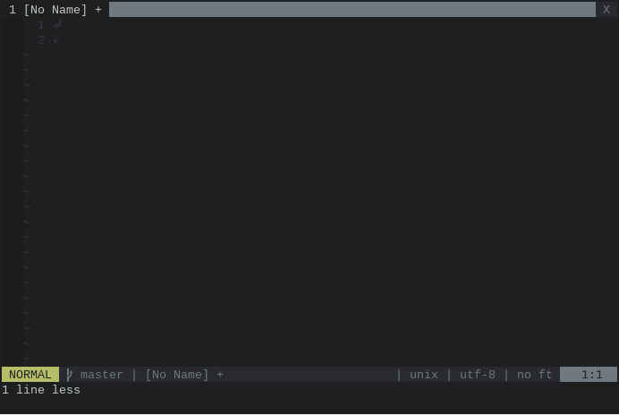
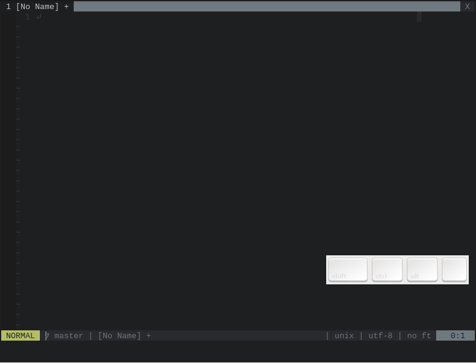
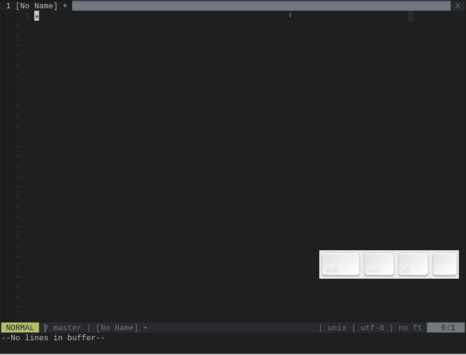
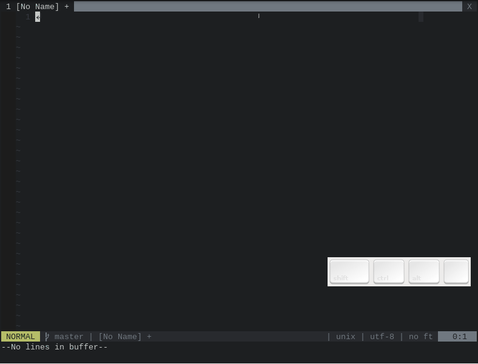
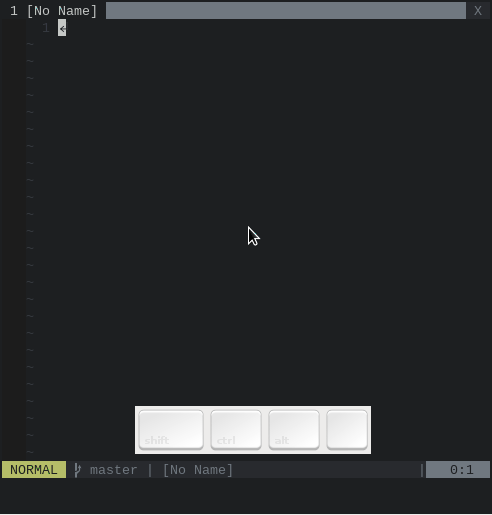

unite-linephrase
===============================================================================

Version: 0.1.1



*unite-linephrase* is a [Unite.vim](https://github.com/Shougo/unite.vim) plugin for listing, searching, manipulating set phrases.
It is developed for one liner set phrases (linephrases), something like:

-	PyPI classifier entries
-	Markdown styled hyperlinks, images, whatever
-	Email addresses

This plugin use files for generating candidates. Basically each lines in the file are translated to source candidates.
Thus even Vim beginners can easily make them own sources for set phrases, it is quite good for users who are too bothered to create original sources as well :-p


Install
-------------------------------------------------------------------------------
The [repository](https://github.com/lambdalisue/unite-linephrase) follow a standard vim plugin's directory structure thus you can use [Vundle.vim](https://github.com/gmarik/Vundle.vim) or [neobundle.vim](https://github.com/Shougo/neobundle.vim) to install it like:

```vim
	" Vundle.vim
	Plugin 'lambdalisue/unite-linephrase'

	" neobundle.vim
	NeoBundle 'lambdalisue/unite-linephrase'

	" neobundle.vim (Lazy)
	NeoBundleLazy 'lambdalisue/unite-linephrase', {
		\ 'autoload': {
		\	'unite_sources': 'linephrase',
		\}}
```

Usage
-------------------------------------------------------------------------------

### How to create a new linephrase file
Hit `<CR>` on "[[ Create a new linephrase file ]]" source in `:Unite linephrase` like the screencast below.



### Use case 1: As a set phrase insertion helper
unite-linephase is developed for inserting a set phase.
When you hit `<CR>`, the selected linephase will be inserted into the current buffer.
You can use it like the screencast below.


### Use case 2: As a simple reference
unite-linephrase can be used as a simple reference.
The working demo is like the screencast below.



### How to edit existing linephrase files
You can open existing linephrase files with Unite action. See the screencast below.



### How to delete existing linephrase files
You can delete existing linephrase files (or linephrase) with Unite action. See the screencast below.




License
-------------------------------------------------------------------------------
The MIT License (MIT)

Copyright (c) 2014 Alisue, hashnote.net

Permission is hereby granted, free of charge, to any person obtaining a copy
of this software and associated documentation files (the "Software"), to deal
in the Software without restriction, including without limitation the rights
to use, copy, modify, merge, publish, distribute, sublicense, and/or sell
copies of the Software, and to permit persons to whom the Software is
furnished to do so, subject to the following conditions:

The above copyright notice and this permission notice shall be included in
all copies or substantial portions of the Software.

THE SOFTWARE IS PROVIDED "AS IS", WITHOUT WARRANTY OF ANY KIND, EXPRESS OR
IMPLIED, INCLUDING BUT NOT LIMITED TO THE WARRANTIES OF MERCHANTABILITY,
FITNESS FOR A PARTICULAR PURPOSE AND NONINFRINGEMENT. IN NO EVENT SHALL THE
AUTHORS OR COPYRIGHT HOLDERS BE LIABLE FOR ANY CLAIM, DAMAGES OR OTHER
LIABILITY, WHETHER IN AN ACTION OF CONTRACT, TORT OR OTHERWISE, ARISING FROM,
OUT OF OR IN CONNECTION WITH THE SOFTWARE OR THE USE OR OTHER DEALINGS IN
THE SOFTWARE.
